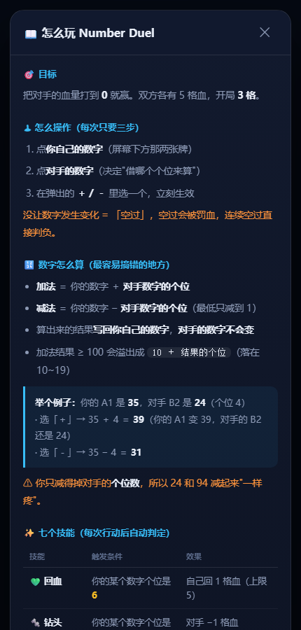
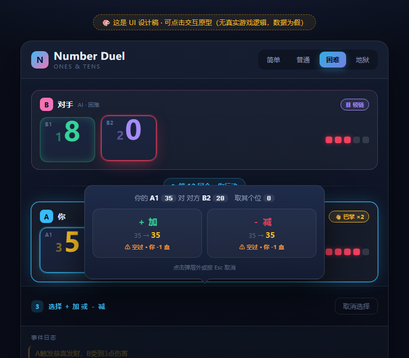

<div align="center">

# Number Duel · 数字对战

**一个回合制数字对战游戏：用「加减」改写自己的数字，凑出条件触发技能，把对手的血打到 0。**

规则来自我小学课间和同学**用手玩**的一个游戏 —— 现在把它做成了能在浏览器里联机对战的版本。

[](https://github.com/YOUR_NAME/number-duel/actions/workflows/ci.yml)


 

</div>

---

## ✨ 这是什么

一个**服务端权威**的回合制对战游戏：

- 🎮 **三种玩法**：单人 vs AI（四档难度）、局域网联机、在线联机
- 🧠 **四档 AI**：随机 → 贪心 → 2 层极小化极大 → 4 层 + Alpha-Beta 剪枝
- 🔬 **133 个自动化测试**：引擎规则、AI 策略、服务端 WebSocket 全流程
- 📦 **核心引擎零依赖**：`game_engine.py` 只用 Python 标准库，随便拷走就能用
- 🐛 **附带四份"死局"排查记录**：见 [四类死局](#-技术亮点四类死局的排查)

---

## 🚀 快速开始

### Windows 一键启动

```bat
:: 双击项目根目录的 start.bat 即可
:: 它会启动服务端并自动打开浏览器
```

### 手动启动

```bash
pip install -r requirements.txt
python server.py
```

启动后终端会打印出两个地址：

```
本机访问（就玩这个地址）  http://127.0.0.1:8000
手机 / 局域网访问        http://192.168.2.188:8000
```

- **电脑上玩**：浏览器打开 `http://127.0.0.1:8000`
- **手机上玩**：手机连同一个 WiFi，打开终端里显示的那个局域网地址
- **和朋友对战**：一方点「创建房间」拿到 4 位房间码，另一方输入房间码加入，房主确认后开局

> ⚠️ **不要直接双击 `web/index.html`**。那样是 `file://` 协议，没有服务器，接口和联机都不可能工作。
> 页面已经内置了拦截提示，会直接告诉你正确做法。

---

## 📖 游戏规则

### 目标

把对手的血量打到 **0**。双方各有 5 格血，开局 **3 格**。

### 操作

点**你自己的数字** → 点**对手的数字** → 在弹出的 `＋ / －` 里选一个。三步完成一回合。

### 数字怎么算

| 操作 | 公式 |
|---|---|
| 加法 | `你的数字 ＋ 对手数字的个位` |
| 减法 | `你的数字 − 对手数字的个位`（最低减到 1） |
| 溢出 | 加法结果 ≥ 100 时变成 `10 ＋ 结果的个位`（落在 10~19） |

> **最容易搞错的点**：算出来的结果**写回你自己的数字**，**对手的数字不会变**。
>
> 例：你的 `A1 = 35`，对手 `B2 = 24`（个位 4）
> `＋` → A1 变成 **39**；`－` → A1 变成 **31**。对手的 B2 始终是 24。

### 七个技能（每次行动后自动判定）

| 技能 | 触发条件 | 效果 |
|---|---|---|
| 💚 回血 | 你的某个数字个位是 **6** | 自己回 1 格血（上限 5） |
| 🔩 钻头 | 你的某个数字个位是 **7** | 对手 −1 格血 |
| 🪃 旋镖 | 两个数字个位**都是 8** | 对手 −1 格血；两个数字都 ≥30 时 −2 格 |
| 💰 恭喜发财 | 两个数字都 **≥30**，个位分别是 **5 和 0** | 对手 −3 格血 |
| 🍡 糖葫芦 | 两个数字都 **≥15**，个位分别是 **8 和 1** | 自己回 2 格血（上限 5） |
| ⛓ 锁链 | 两个数字都 **≥20**，个位**都是 9** | 对手下一回合直接被跳过 |
| 👋 巴掌 | 两个数字都 **≥15**，个位**都是 5** | 每回合 −1 格血，最多持续 3 回合 |

### 数字颜色分级

| 颜色 | 范围 | 含义 |
|---|---|---|
| ⚪ 白色 | 0 ~ 9 | 够不到任何门槛 |
| 🟢 绿色 | 10 ~ 19 | 接近糖葫芦 / 巴掌的 15 门槛 |
| 🟣 紫色 | 20 ~ 29 | 够到锁链的 20 门槛 |
| 🟡 金色 | 30 以上 | 够到恭喜发财的 30 门槛 |

### 防刷机制

同一个数字**自上次触发该技能以来没有变化过**时，技能不会再次触发；双数字技能要求两个数字都变化过。

判定的是"**有没有变过**"，不是"值是否相同" —— 所以 `26 → 20 → 26` 绕一圈回来，技能**可以**再次触发。

### 三条防僵持规则

1. **空过惩罚**：一次行动没让任何数字变化 = 空过。
   第 1 次警告 → 每满 2 次扣 1 格血 → **连续 4 次直接判负**。（被锁链跳过不算空过）
2. **僵持判定**：连续 50 手双方总血量都没能再降低（说明谁也打不动谁）→ 血量高者获胜，相同则平局。
3. 数字最低为 **1**，永远不会变成 0。

---

## 🔬 技术亮点：四类死局的排查

这个项目最有意思的部分不是游戏本身，而是**它在开发过程中连续暴露了四类"永远打不完"的死局**。
每一条都是先用代码复现、再用穷举或数据证明、最后量化验证修复效果的。

### 死局 ①：全零僵局

四个数字全部为 0 时，加法 `0 + 0 = 0`、减法 `max(0, 0 - 0) = 0`，
**任何操作都是空转**，血量永远不变。

### 死局 ②：奇偶锁定（最隐蔽的一个）

加法与减法本质上都是"两个数相加/相减"，而 **偶数 ∓ 偶数永远是偶数**。
所以四个数字一旦全部变成偶数，就形成了一个**数学闭集**：

```
实测：第 87 手首次出现全偶数状态
      穷举该状态下的全部 16 种合法操作 → 能变回奇数的：0 种
```

后果是灾难性的 —— 偶数个位只有 `0/2/4/6/8`，于是：

| 技能 | 要求个位 | 是否永久失效 |
|---|---|---|
| 钻头 | 7 | ❌ 失效 |
| 锁链 | 9 | ❌ 失效 |
| 恭喜发财 | 5 和 0 | ❌ 失效 |
| 糖葫芦 | 8 和 1 | ❌ 失效 |
| 巴掌 | 5、5 | ❌ 失效 |
| 回血 / 旋镖 | 6 / 8 | ✅ 存活 |

**7 个技能里 5 个永久失效**，只剩回血和旋镖，血量被回血持续抬回上限：

```
20000 手内：回血触发 1541 次，旋镖 235 次，其余技能合计不到 10 次
```

**修复**：把减法下限从 `0` 改成 `1`（`SUB_FLOOR = 1`）。
下限是奇数，凡是减到下限的场合都会重新注入奇数，全偶数不再是闭集。
顺带也消灭了死局 ①。实测打破全偶数的操作数从 **0/16 → 4/16**。

### 死局 ③：空过僵持

攻方的数字只由**守方数字的个位数**决定。所以只要守方两个数字的个位都是 `0`，
攻方就**完全无法改变任何数字** —— 而"空过"又是绝对安全的选择，强 AI 会一直空过。

```
实测：地狱 vs 地狱，2000 回合打不完，状态永久冻结在 A=13,20 B=10,10

附带性能灾难：冻结态下 8 种着法分值完全相同，
              Alpha-Beta 剪枝彻底失效，AI 每步耗时从 100ms 暴涨到 1~2 秒
```

**修复**：空过分级惩罚。第 1 次警告 → 每满 2 次扣 1 血 → 连续 4 次判负。
这样僵持时血量必然收敛；同时"把数字凑成整十来锁死对手"变成了一条正当战术。

### 死局 ④：循环僵持（改完防刷后又冒出来的）

防刷记录原本存的是**数值**，于是"值反复出现"就永久封印了技能：

```
实测周期仅 4 手的循环：
A=(18,18) B=(38,31) → (18,18,46,31) → (18,17,46,31) → ... 永远反复
其中 A2=17 本该触发钻头、B1=46 本该触发回血，但防刷记录恰好存着这两个值
```

**修复（两处）**：

1. 防刷记录改存**变化代数**而不是数值 —— "这个数字自上次触发以来有没有变过"
2. 僵持判定从"血量有没有变化"升级为"**双方总血量有没有跌破历史新低**" ——
   因为修完防刷后，钻头（−1）和回血（+1）会**刚好抵消**，血量一直在变但谁也打不动谁，
   只看"有没有变化"照样会被骗过去

### 修复效果

| 指标 | 修复前 | 修复后 |
|---|---|---|
| AI 对局卡死率 | 28/100 | **0/105** |
| 进入过全偶数锁定的对局 | 57/100 | **0/100** |
| 能打破全偶数的操作 | 0 / 16 | **4 / 16** |
| 已结束对局中位回合数 | 414（且大量打不完） | **20 ~ 50** |
| 数字最小值（狂点 500 手减法） | 0 并锁死 | **1** |

> 完整的排查过程、原始数据和复现脚本见 [`docs/deadlock-analysis.md`](docs/deadlock-analysis.md)。

---

## 🏗 架构

```
┌─────────────────┐   HTTP + WebSocket   ┌──────────────────────────────┐
│  浏览器客户端    │ ◄──────────────────► │  server.py (FastAPI)         │
│  (只负责显示点击) │                      │   ├── game_engine.py  ← 规则  │
└─────────────────┘                      │   └── ai.py           ← AI    │
                                          └──────────────────────────────┘
```

**服务端权威**是核心设计决定：

- 游戏规则**全部跑在服务端**，浏览器只发「我选 A1 打 B2 用加法」，服务端算完再广播结果
- 客户端**无法作弊**（改 JS 也没用，规则不在前端）
- 规则**只有一份**，不需要在 JS 里重写一遍，避免两边逻辑跑偏
- 以后部署到云服务器，玩法完全不变

---

## 📁 项目结构

```
number-duel/
├── game_engine.py            # 核心引擎：游戏规则与状态（零依赖，无 UI）
├── ai.py                     # AI 策略：四档难度
├── server.py                 # FastAPI + WebSocket 服务端（房间 / 邀请 / 联机）
├── start.bat                 # Windows 一键启动
│
├── test_game_engine.py       # 引擎测试（102 个）
├── test_ai.py                # AI 测试（21 个）
├── test_server.py            # 服务端集成测试（10 个，真起 uvicorn）
├── ai_tournament.py          # AI 强度循环赛验证工具
│
├── web/
│   ├── index.html            # 真实客户端（单文件，含完整规则说明）
│   ├── mockup.html           # 早期 UI 设计稿（可点击原型）
│   ├── rules.png             # 截图：规则页
│   └── mockup.png            # 截图：对局界面
│
├── tools/
│   └── cdp_screenshot.py     # 基于 CDP 的截图工具（可执行 JS 驱动页面）
│
├── docs/
│   └── deadlock-analysis.md  # 四类死局的完整排查记录
│
└── .github/workflows/ci.yml  # CI：Python 3.10/3.11/3.12 三版本跑全部测试
```

---

## 🧪 开发与测试

```bash
# 跑全部测试
python -m unittest discover -s . -p "test_*.py"

# 只跑引擎 / AI（不需要装任何第三方库）
python -m unittest test_game_engine test_ai

# AI 强度循环赛
python ai_tournament.py -n 6
```

### AI 强度梯度（实测）

| 先手 | 后手 | 结果 |
|---|---|---|
| 简单 | 普通 | 0 : 6 |
| 简单 | 困难 | 0 : 6 |
| 简单 | 地狱 | 0 : 6 |
| 普通 | 困难 | 0 : 6 |
| 普通 | 地狱 | 0 : 6 |
| 困难 | 地狱 | 1 : 11 |

因为本游戏是**完全信息、无随机数**的确定性博弈，极小化极大搜索得到的结论是**精确解**，
不依赖蒙特卡洛采样 —— 这是它和一般"随机出招 AI"的本质区别。

---

## 🗺 路线图

- [x] 核心引擎 + 133 个测试
- [x] 四档 AI（含 Alpha-Beta 剪枝）
- [x] 浏览器客户端 + 完整新手教程
- [x] 局域网 / 在线联机（房间码 + 邀请确认）
- [x] 四类死局的排查与修复
- [ ] Docker 容器化 + Nginx 反向代理
- [ ] CI/CD 自动构建镜像并部署
- [ ] 百万局对局数据模拟与分析（DuckDB / 可视化报告）

---

## 📄 许可

[MIT](LICENSE) —— 随便用，能标注来源更好。
